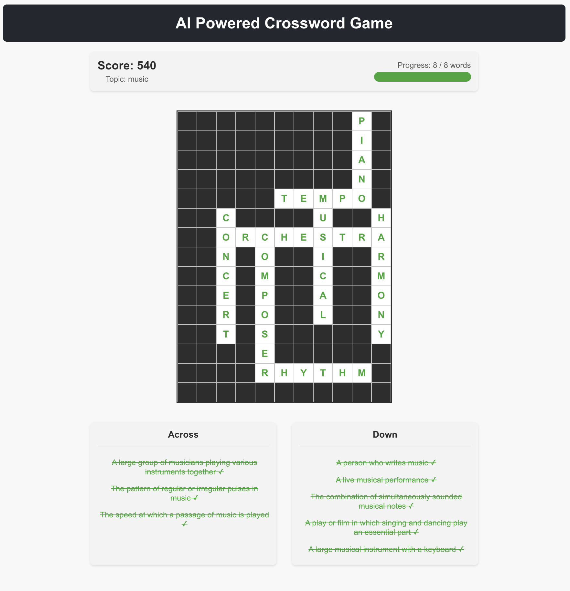

# AI Powered Crossword Game

A dynamic, topic-based crossword puzzle game built with React. Challenge yourself with crossword puzzles generated based on the topic of your choice!



## Features

- **Topic-based puzzles**: Type any topic and get an AI generated crossword puzzle related to that topic
- **Dynamic generation**: Every puzzle is unique and dynamically created
- **Interactive gameplay**: Click on clues to highlight corresponding cells in the grid
- **Score tracking**: Earn points based on the length of completed words
- **Celebrations**: Receive congratulatory messages when you complete words
- **Responsive design**: Play on any device

## Technologies Used

- React.js
- JavaScript (ES6+)
- CSS3
- HTML5

## Getting Started

### Prerequisites

- Node.js (v12.0.0 or later)
- npm (v6.0.0 or later)

### Installation

1. Clone the repository:
   ```bash
   git clone https://github.com/jorgecontreras/crossword-game.git
   cd crossword-game
   ```

2. Install dependencies:
   ```bash
   npm install
   ```

3. Set up environment variables:
   - Create a `.env` file in the root directory
   - Add your Anthropic API key:
     ```
     ANTHROPIC_API_KEY=your_api_key_here
     ```

4. Start the development server:
   ```bash
   npm start
   ```

5. In a separate terminal, start the backend server:
   ```bash
   npm run server
   ```

6. Open your browser and navigate to `http://localhost:3000`

## How to Play

1. Enter a topic in the input field (e.g., "movies", "sports", "technology")
2. Click "Create Crossword" to generate a puzzle based on your chosen topic
3. Click on a clue to highlight its cells in the grid
4. Type letters into the highlighted cells to solve the puzzle
5. Complete all words to finish the crossword

## Word Categories

The game includes words from various categories including:
- Technology
- Sports
- Movies
- Music
- Food
- And more!

## Future Enhancements

- Timer functionality
- Difficulty levels
- Hint system
- Puzzle saving and loading
- Multiplayer mode

## License

This project is licensed under the MIT License - see the LICENSE file for details.

## Acknowledgments

- Created by Jorge Contreras
- Powered by Anthropic API
